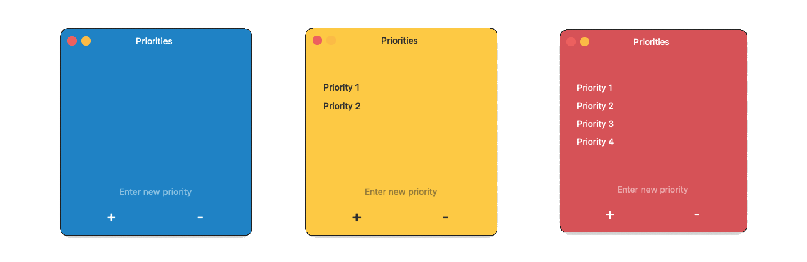

# Priorities App

#### Video Demo: <https://youtu.be/WQsElH6-7Og>

## Overview

Priorities is a simple task management application for macOS that helps you keep track of your priorities. It is written in Python and uses the PyQt5 library, which allows complete customization of the user interface. The app features a user-friendly interface that changes color based on the number of tasks you have:

- Blue when you have a few priorities to complete.
- Yellow when you have some priorities.
- Red when you have too many priorities.

The user interface allows navigation with both the mouse and the keyboard (tabs, arrows, enter, and backspace) for quick task addition and removal. When you start typing directly with letters or numbers, the focus shifts to the input box.

Additionally, the app features a text editor functionality for selected tasks. This means you can easily edit a task by selecting it. Moreover, the application supports text wrapping when the text is too long. This ensures that all the information entered for a task is visible and easy to read, even if it is a lengthy sentence or includes several details.

## Usage

1. Open `Priorities.app`.
2. Add a new task by typing into the input box at the bottom of the window and pressing `Enter` or the `+ button`.
3. Remove a task by selecting it and pressing `Backspace`, the `- button` or `space`
4. Navigate through your tasks using the arrow or tab keys.
5. Edit a task clicking twice or pressing `Enter` on it.
6. Pressing the `- button` when no task is selected will delete the first task on the list.

## Installation

You can try the program downloading the .dmg package [here](https://drive.google.com/file/d/1TM5l0KVY6Tt3-fb23mcqDD-uOJV5w9d7/view?usp=drive_link).

## Contributing

Contributions are welcome! Please open an issue or submit a pull request on [GitHub](https://github.com/yourusername/priorities-app).

## Credits

&copy; Alex Arroyo 2023
